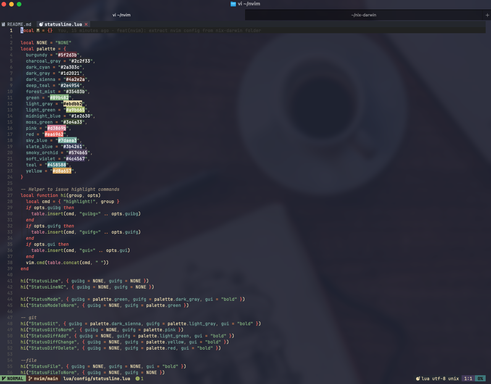
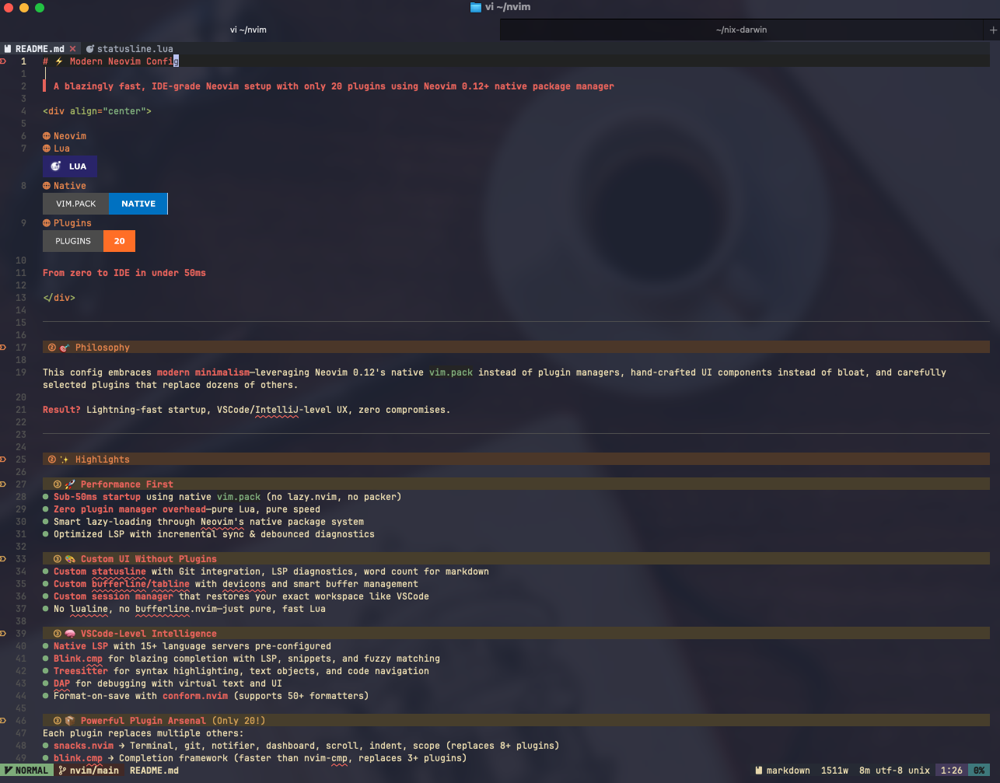

# My Neovim config

> Fast, IDE-grade Neovim setup with 20 plugins using native `vim.pack` (no plugin manager needed)


- Sub-50ms startup using native `vim.pack` (no lazy.nvim/packer overhead)
- Custom UI components (statusline, bufferline, session manager) without extra plugins
- 15+ LSP servers pre-configured with format-on-save
- Session persistence that restores your workspace as VSCode

## Core Plugins

| Plugin               | Purpose                                                                      |
| -------------------- | ---------------------------------------------------------------------------- |
| snacks.nvim          | Picker, Explorer, Terminal, git, notifier, dashboard, scroll, indent, ...etc |
| blink.cmp            | Completion with LSP, snippets, fuzzy matching                                |
| treesitter           | Syntax highlighting, text objects, navigation                                |
| gitsigns.nvim        | Git signs, blame, diff integration                                           |
| grug-far.nvim        | Search & replace UI                                                          |
| which-key.nvim       | Command palette & keybind helper                                             |
| conform.nvim         | Auto-formatting (50+ formatters)                                             |
| noice.nvim           | Modern UI for messages/cmdline                                               |
| flash.nvim           | Jump navigation                                                              |
| yanky.nvim           | Yank history with smart paste                                                |
| render-markdown.nvim | Beautiful in-buffer markdown rendering                                       |
| diffview.nvim        | Git diff and merge tool                                                      |
| catppuccin           | Colorscheme                                                                  |
| nvim-dap             | Debugging with virtual text & UI                                             |

## Custom features (no plugins required)

- Custom statusline - Git branch/diff, LSP diagnostics, word count for markdown
- Custom bufferline - Smart buffer management with devicons
- Session manager - Per-directory auto-save/restore
- LSP utilities - Unified setup helpers

I also wrote a series of articles about my [Neovim config](https://tduyng.com/tags/neovim/)

## Installation

```bash
# Backup existing config
mv ~/.config/nvim ~/.config/nvim.bak

# Clone
git clone https://gitlab.com/tduyng/nvim.git ~/.config/nvim

# Launch (plugins install automatically)
nvim
```

Prerequisites: Neovim 0.12+, Git, Ripgrep, Nerd Font

Update plugins: `<leader>pu` or `:lua vim.pack.update()`

## Development

Validate the config before committing:

```bash
just validate  # Run all checks (loads config in headless nvim + checks formatting)
just check     # Test config loads without errors
just fmt       # Format all Lua files with StyLua
```

## Quick Start

Leader key: `Space`

### Essential keybindings

```
Files & Search
  <leader><leader>  Find files
  <leader>L/  Live grep
  <leader>sr  Search & replace

Buffers
  Tab / S-Tab Navigate buffers
  <leader>bb  Switch to recent buffer
  <leader>bl  Close buffers to left
  <leader>br  Close buffers to right
  <leader>bo  Close all other buffers

Windows
  Ctrl-h/j/k/l  Navigate windows
  <leader>sv    Vertical split
  <leader>sh    Horizontal split

LSP
  gd           Go to definition
  gr           Go to references
  K            Hover documentation
  <leader>ca   Code actions
  <leader>cd   Diagnostic errors
  <leader>rn   Rename symbol
  <leader>cf   Format buffer

Git
  <leader>gg   LazyGit
  <leader>gb   Git blame
  <leader>gd   Git diff

Sessions
  <leader>qs   Load session (cwd)
  <leader>ql   Load last session
  <leader>qS   Select session
  <leader>qd   Stop auto-save

Debug (DAP)
  <leader>db   Toggle breakpoint
  <leader>dc   Continue
  <leader>di   Step into
  <leader>do   Step over
```

A lot of keymaps as in [Lazyvim/keymaps](https://www.lazyvim.org/keymaps).

## Screenshots





---

## License

MIT
